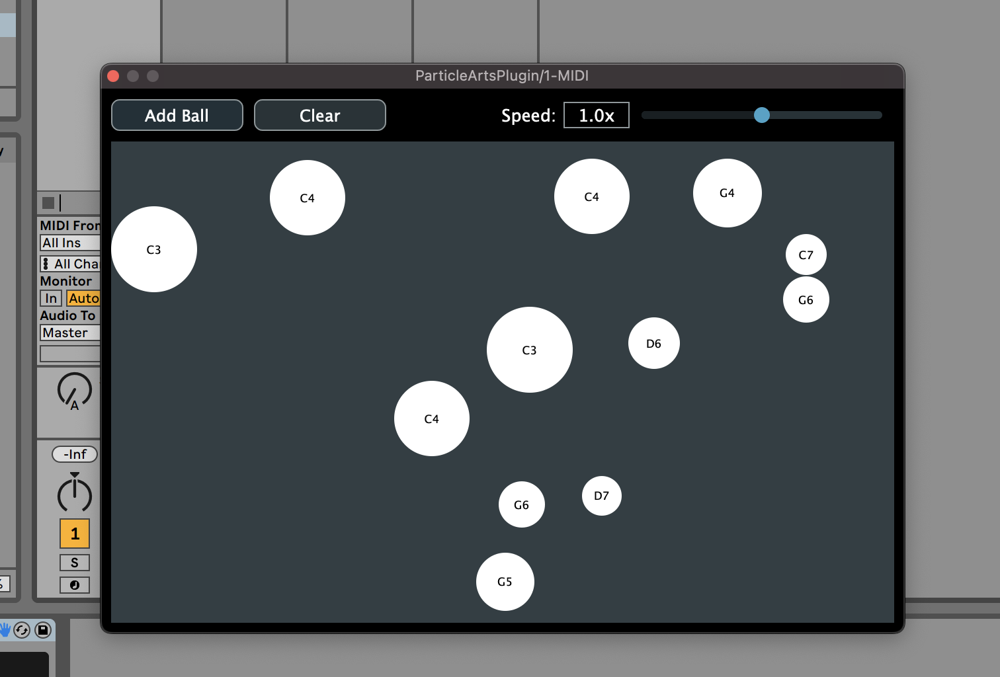

# ParticleArtsPlugin 🎵

ParticleArtsPlugin is a VST3 plugin built with [**JUCE**](https://juce.com) that allows you to generate semi-random MIDI signals with particle physics.

When running the plugin, input signals from an external MIDI device become bouncing 2-D particles with matching pitch and initial velocity. When particles collide, their respective pitches are output as MIDI signals with velocities corresponding to their pre-collision momentum.

Route these output MIDI signals to any MIDI software instrument for a cool randomized effect!

## Some tips:

- I've found that adding a delay effect on top of any synth patch creates cool sounds.
- MIDI output signals are very short. If your DAW has it, use a MIDI note length effect to widen them a bit.
- For best results, stick to a small amount of consonant notes (try only 1, 2, 5). Less is more!
- The "Add Ball" button randomly adds a note in a subset of C's, D's, and G's.
- I've added a velocity slider to control overall particle speed.

# Installation:

> Note: So far, I've only tested this plugin on MacOS. You can get it to run on Windows but you may have to mess with Projucer settings. I'm also looking into how to deploy this as a downloadable VST file and not just source code.

1. Download and install JUCE (the [personal plan](https://juce.com/get-juce) is free).
2. Clone this repository and open the .jucer file in Projucer. All modules/project settings should be configured automatically.
3. Make sure you configure Projucer to know your machine's VST3 folder.
4. When the project builds successfully, you should find ParticleArtsPlugin under your VSTs and ready for use.
5. Test it out either in JUCE's AudioPluginHost or in a DAW!
